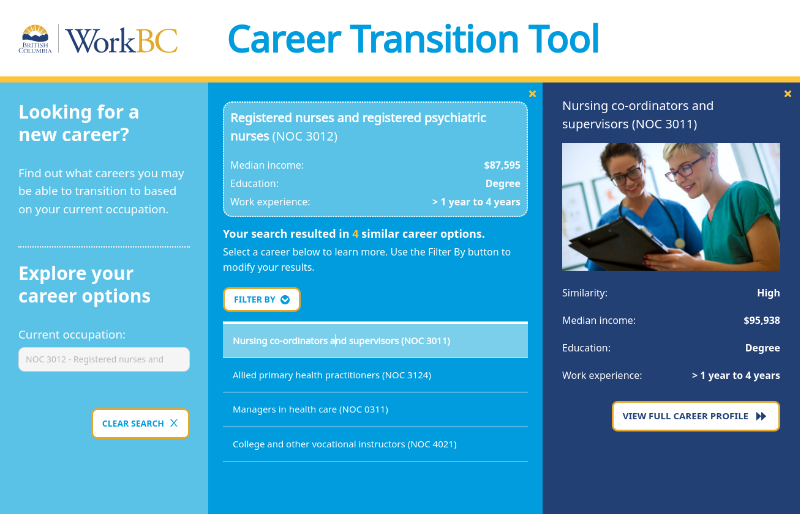
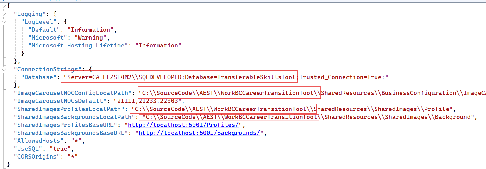
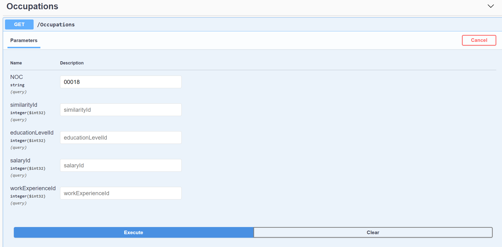
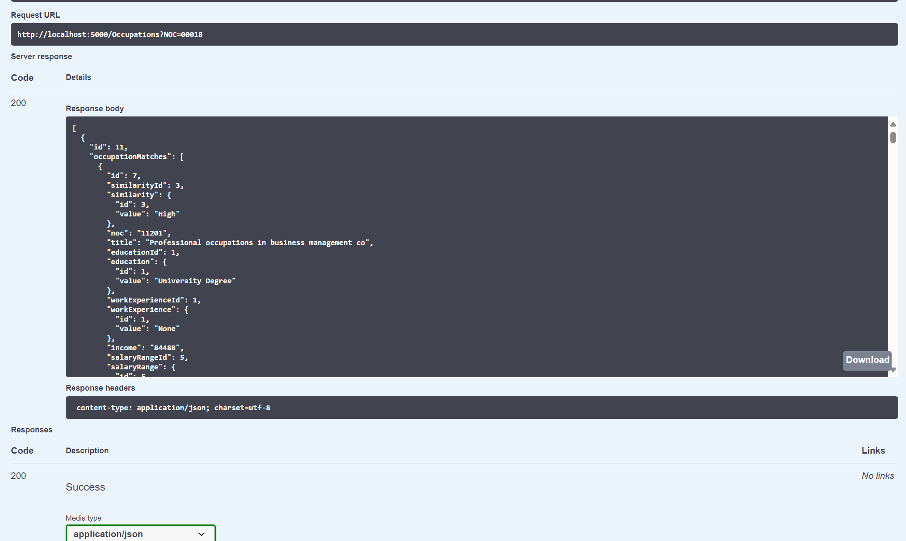

WorkBC Career Transition Tool
=============================



# Local Setup
## Prerequisites
* NodeJS v10.19. It is recommended to use [NVM to install Node.js](https://github.com/coreybutler/nvm-windows) so you can have more than one version of NodeJS on your machine.

* MS SQL Server. Download [SQL Server 2017](https://www.microsoft.com/en-ca/download/details.aspx?id=55994) or newer. Be sure to download [SQL Server Management Studio](https://docs.microsoft.com/en-us/sql/ssms/download-sql-server-management-studio-ssms?view=sql-server-ver15) as well.

* Visual Studio. Download [Visual Studio 2022 or later](https://visualstudio.microsoft.com/downloads/). The community version will work fine for the project.

* .NET 3.1 SDK (The project will fail to build with SDK 6.0)

## Backend Setup
* Install prerequisites
* Open Microsoft SQL Server Management Studio
* Connect to your localhost server
* On Microsoft SQL Server Management Studio, right-click on Databases and “Restore Database…”
* Select “Device” option and restore a backup of the CTT database.
* Modify config **WorkBC Career Transition Tool API\appsettings.json** to your local database server instance and name. Also, update the source code paths as shown below:



* In command prompt, run:
```
cd \path\to\WorkBC Career Transition Tool API
dotnet run
```
* Open Swagger UI at http://localhost:5000
* Test `/Occupations` endpoint with any test NOC value:



* You should receive a response code of 200 with following output:



## Frontend Setup
Refer to the [frontend README](WorkBC Career Transition Tool WEB/careerTransitionTool/README.md).
